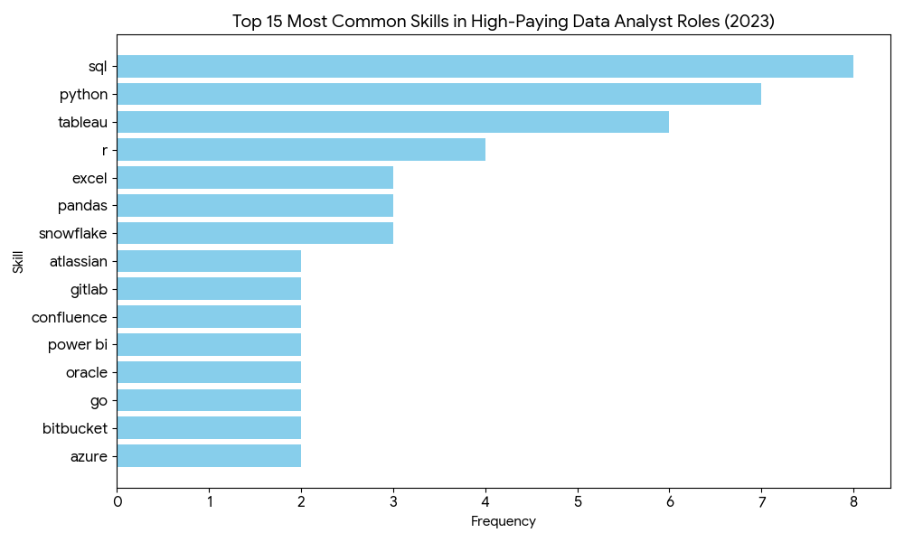

# 📊 Data Job Market Analysis

## 🔍 Project Overview
An in-depth exploration of the data analyst job market, focusing on remote opportunities to identify top-paying roles, trending skills, and the intersection of high demand and high salary. This project was built to navigate the data career landscape strategically by transforming raw data into actionable insights.

### The Questions I Wanted to Answer:
1. What are the highest-paying remote Data Analyst roles?
2. Which skills are "Must-Haves" for top-tier compensation?
3. What skills are most in demand for data analysts?
4. Where is the "Sweet Spot" between high demand and high pay?

## 🛠️ Tech Stack
* **SQL:** The core engine used for data extraction and analysis.
* **PostgreSQL:** The database management system housing the job data.
* **Visual Studio Code:** My primary environment for writing and testing queries.
* **Git & GitHub:** For version control and project documentation.

---

## 📈 The Analysis: Top Insights

### 1. The High-Pay Landscape
Filtering for remote "Data Analyst" roles, I discovered that the top 10 salaries range from **$184,000 to $650,000**. 
* **Insight:** High-paying roles often include leadership titles like "Director of Analytics," showing that career growth significantly boosts pay.

### 2. Skills for the Top 1%
By joining job postings with skill dimensions, a clear pattern emerged for the highest-paying roles. As shown in the visualization below, **SQL**, **Python**, and **Tableau** are the most critical skills for high-compensation positions.

*Visualizing the frequency of skills requested in the highest-paying data analyst roles (2023).*

### 3. Most In-Demand Skills
Beyond the high-pay niche, I analyzed total market demand (over 7,000 postings):
* **The "Big Three":** SQL, Excel, and Python dominate the volume of job postings, proving their essential status in the industry.

### 4. The "Optimal" Skillset (High Demand + High Pay)
Using **CTEs** to find the "Sweet Spot," I identified skills that offer both stability and a premium salary:
* **Cloud Platforms:** Snowflake, Azure, and AWS are top performers.
* **Big Data:** Hadoop and BigQuery skills command salaries averaging over **$100k**.

---

## 🧠 What I Learned
Through this project, I moved beyond basic queries into advanced data engineering techniques:
* **🧩 Complex Query Crafting:** Mastered the art of advanced SQL, merging tables like a pro and wielding `WITH` clauses (CTEs) for multi-step logic.
* **📊 Data Aggregation:** Used `GROUP BY` and aggregate functions like `COUNT()` and `AVG()` to summarize thousands of job postings.
* **💡 Analytical Thinking:** Leveled up my ability to turn real-world business questions into precise SQL queries.

## 🏁 Conclusion
The data is clear: **SQL is the king of data analytics.** Whether you want high pay or high job security, mastering SQL remains the most optimal investment for a data career.

**[View all SQL queries here](/project_sql/)**

---
## 🙏 Credits
This project was created as part of the **"SQL for Data Analytics"** course by **Luke Barousse**. 
* [Link to the YouTube Course](https://www.youtube.com/watch?v=7mz73uXD9DA)
* Special thanks to Luke for providing the dataset and the strategic project framework!